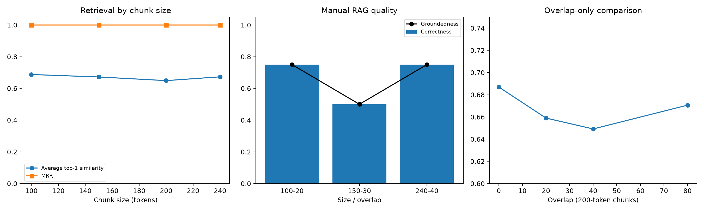

# Day 5 — Chunking Experiment Report

## Objective and hypothesis

This experiment measures how chunk size and overlap affect retrieval quality, answer quality, latency, prompt size, and storage. The hypothesis was that very small chunks would improve semantic focus but risk losing context, while very large chunks would preserve context but introduce irrelevant text. A middle configuration such as 150/30 or 200/40 was expected to offer the best balance.

## Controlled method

The document corpus, evaluation questions, MiniLM embedding model, Qwen generation model, PostgreSQL/pgvector database, retrieval top-k, prompt, and evaluation metrics were held constant. Only `CHUNK_SIZE` and `CHUNK_OVERLAP` changed. Every configuration was re-ingested before evaluation, and every run used a unique label so results were not overwritten.

Primary configurations:

| Label | Chunk size | Overlap |
|---|---:|---:|
| chunk-100-20 | 100 | 20 |
| chunk-150-30 | 150 | 30 |
| chunk-200-40 | 200 | 40 |
| chunk-240-40 | 240 | 40 |

## Retrieval and corpus results

| Configuration | Chunks | Avg chunk tokens | Hit@1 | Recall@5 | MRR | Avg top-1 similarity | Avg retrieval (s) |
|---|---:|---:|---:|---:|---:|---:|---:|
| 100/20 | 17 | 85.71 | 1.000 | 1.000 | 1.000 | 0.6877 | 0.0989 |
| 150/30 | 11 | 127.91 | 1.000 | 1.000 | 1.000 | 0.6721 | 0.0965 |
| 200/40 | 8 | 169.63 | 1.000 | 1.000 | 1.000 | 0.6492 | 0.0955 |
| 240/40 | 8 | 169.63 | 1.000 | 1.000 | 1.000 | 0.6731 | 0.1311 |

All four configurations found the expected document at rank 1 for all four answerable questions. Consequently, Hit@1, Hit@3, Hit@5, Recall@5, and MRR could not distinguish them. Average top-1 similarity was the useful secondary retrieval signal: 100/20 scored highest, while 200/40 scored lowest.

## Boundary and failure analysis

There were no document-level rank failures. Exact chunk exports showed the more subtle boundary effects:

- 100/20 split the PostgreSQL replication explanation across five chunks, but overlap preserved enough local context for a strong 0.8039 similarity.
- 150/30 kept more of the replication mechanism together and produced the highest score for that question (0.8128), but it weakened the Kafka and MVCC questions.
- 200/40 produced only eight chunks and the weakest mean top-1 similarity.
- 240/40 helped Kubernetes scheduling and MVCC but weakened Kafka and fragmented the long replication document into uneven chunks.

The detailed question-level evidence is in `failure-analysis.md` and the exact text is in `boundaries/`.

## Overlap-only mini-experiment

With chunk size fixed at 200, overlaps of 0, 20, 40, and 80 were tested.

| Overlap | Chunks | MRR | Avg top-1 similarity |
|---:|---:|---:|---:|
| 0 | 8 | 1.000 | 0.6869 |
| 20 | 8 | 1.000 | 0.6590 |
| 40 | 8 | 1.000 | 0.6492 |
| 80 | 9 | 1.000 | 0.6706 |

Overlap did not improve rank quality for this corpus. Zero overlap produced the strongest average similarity, while 80-token overlap created an extra chunk. This does not establish that overlap is generally harmful; it shows only that these short, topically focused documents did not need additional duplicated context.

## Full RAG results

The three candidates selected for end-to-end evaluation were 100/20, 150/30, and 240/40. Manual scores use a strict binary rubric: an answer receives zero if it contains a material factual error or an unsupported claim.

| Configuration | Correctness | Groundedness | Citation support | Refusal accuracy | Avg prompt tokens | Avg generation (s) |
|---|---:|---:|---:|---:|---:|---:|
| 100/20 | 0.75 | 0.75 | 0.00 | 1.00 | 774.75 | 90.91 |
| 150/30 | 0.50 | 0.50 | 0.00 | 1.00 | 882.00 | 124.70 |
| 240/40 | 0.75 | 0.75 | 0.00 | 1.00 | 858.00 | 111.75 |

100/20 and 240/40 tied on manual correctness and groundedness. 100/20 won the tie because it had the highest mean retrieval similarity, used 83 fewer prompt tokens on average, and generated about 21 seconds faster per answer. The 150/30 answers contained material scheduler and Kafka-role errors. All candidates correctly refused the two out-of-scope questions because retrieval results below the 0.30 similarity threshold were excluded.

No generated answer included a source marker, so citation support remained zero. This is a generation/prompt compliance issue and should be addressed separately rather than hidden by the chunking decision.



## Decision

The selected production configuration is:

```text
CHUNK_SIZE=100
CHUNK_OVERLAP=20
```

This choice is based on end-to-end answer quality and efficiency, not MRR alone. The final clean run reproduced the candidate answers exactly and recorded Hit@1/3/5, Recall@5, and MRR of 1.000, average prompt size of 774.75 tokens, average generation time of 89.58 seconds, 0.75 manual correctness/groundedness, and 1.00 refusal accuracy.

## Limitations and next steps

- The answerable set has only four questions and one expected source per question, so perfect rank metrics are easy to saturate.
- CPU generation latency is large and can vary with machine load.
- Relation size includes PostgreSQL allocation effects and is not a precise per-chunk storage cost.
- Future evaluation should add multi-document and boundary-sensitive questions, fix citation formatting, and repeat latency runs before treating these findings as generally applicable.

## Artifacts

- `hypothesis.md`: prediction and controlled variables
- `*-corpus.csv`, `*-retrieval.csv`, `*-rag.csv`: raw run outputs
- `retrieval-comparison.csv`, `rag-comparison.csv`, `overlap-comparison.csv`: summaries
- `failure-analysis.md` and `boundaries/`: question-level inspection
- `final-retrieval.csv`, `final-rag.csv`: clean winner baseline
- `chunking-comparison.png`: comparison graph
