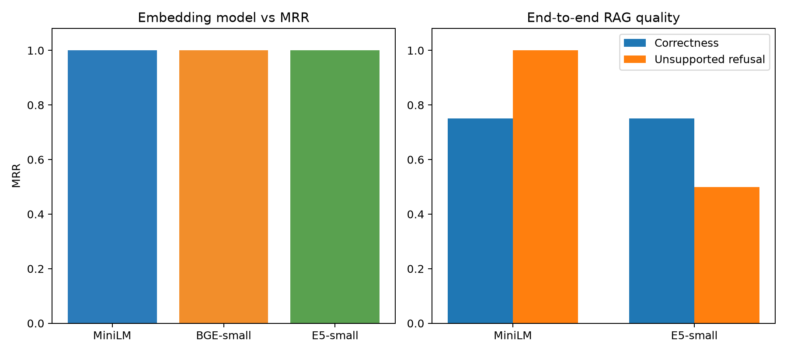

# Day 6 — Embedding Model Evaluation

## Research Question

Does embedding-model choice materially affect semantic retrieval and downstream RAG quality enough to justify additional compute cost?

## Hypothesis

BGE-small and E5-small are retrieval-specific models and were expected to improve technical question-to-passage ranking over MiniLM, possibly at lower throughput or higher query latency.

## Controlled Variables

- Corpus: four technical Markdown documents
- Chunk size/overlap: the Day 5 winner, 100/20
- Top-K: 5
- Vector dimension: 384
- Distance: normalized cosine similarity
- Generator: Qwen2.5-1.5B-Instruct
- Prompt, hardware, and scoring rubric: unchanged

The retrieval set was expanded to 16 answerable questions plus four unsupported questions. For historical comparability and bounded CPU cost, full RAG used the original six-question baseline (four answerable, two unsupported) for both finalists.

## Models and Correct Encoding

| Model | Query format | Document format | Dimension | Maximum sequence |
|---|---|---|---:|---:|
| MiniLM | no prefix | no prefix | 384 | 256 |
| BGE-small-en-v1.5 | retrieval instruction | no prefix | 384 | 512 |
| E5-small-v2 | `query:` | `passage:` | 384 | 512 |

`EmbeddingService` centralizes these formats and validates the dimension. Ingestion records its model/chunk configuration in `corpus_config`; `Retriever` rejects a query model that does not match the stored corpus model.

## Retrieval Results

| Model | Hit@1 | Hit@3 | Hit@5 | Recall@5 | MRR | P50 query (ms) | P95 query (ms) | Chunks/sec |
|---|---:|---:|---:|---:|---:|---:|---:|---:|
| MiniLM | 1.000 | 1.000 | 1.000 | 1.000 | 1.000 | 14.07 | 16.69 | 62.12 |
| BGE-small | 1.000 | 1.000 | 1.000 | 1.000 | 1.000 | 26.92 | 29.16 | 32.06 |
| E5-small | 1.000 | 1.000 | 1.000 | 1.000 | 1.000 | 25.56 | 28.39 | 32.81 |

All three models saturated document-level ranking because the corpus contains only four strongly separated topics. Raw cosine values were not compared across models because their score distributions differ. MiniLM was approximately 1.9× faster for warm-cache document embedding and had the lowest query latency.

## Disagreement Analysis

Five questions selected different top chunks despite agreeing on the top document. E5 selected more precise evidence for snapshot behavior and post-binding kubelet actions; BGE regressed on the physical-versus-logical replication comparison. Full details are in `disagreement-analysis.md`.

## RAG Results

MiniLM and E5 advanced because MiniLM was the efficiency leader and E5 narrowly outperformed BGE on throughput and query P95.

| Model | Correctness | Groundedness | Citation support | Unsupported refusal | Avg prompt tokens | Generation P95 (s) |
|---|---:|---:|---:|---:|---:|---:|
| MiniLM | 0.75 | 0.75 | 0.00 | 1.00 | 774.75 | 129.75 |
| E5-small | 0.75 | 0.75 | 0.00 | 0.50 | 858.75 | 142.82 |

Both models generated three fully acceptable answers out of four. Both overstated aspects of MVCC. Neither followed the source-citation requirement on answerable questions.

The most important result was E5's refusal regression. The unchanged 0.30 threshold was calibrated on MiniLM's cosine distribution. E5 retrieved chunks above that threshold for unrelated questions, answered the Japan question from parametric memory, and only verbally declined the World Cup question. This demonstrates that a confidence threshold must be recalibrated whenever the embedding model changes.

## Selected Model

`sentence-transformers/all-MiniLM-L6-v2` remains selected.

## Why

- Retrieval quality tied across all three models.
- End-to-end correctness and groundedness tied between MiniLM and E5.
- MiniLM preserved 100% unsupported refusal; E5 achieved 50%.
- MiniLM embedded chunks roughly 1.9× faster and had lower query P50/P95.
- MiniLM used fewer prompt tokens and had lower generation P95 in this run.

The larger retrieval-specific models therefore added cost without a measured system-quality improvement on this dataset.

## Trade-offs and Limitations

- Document-level metrics are saturated; chunk-level relevance labels are needed for finer ranking evaluation.
- The corpus is small, English-only, and contains clearly separated topics.
- Throughput is a single warm-cache CPU observation and should be repeated for formal benchmarking.
- Docker Desktop 4.87 failed before PostgreSQL startup because Windows could not access recreated Unix-socket reparse points. Retrieval/RAG measurements therefore used the equivalent in-memory normalized-cosine path; the production PostgreSQL ingestion and mismatch checks were implemented but require re-ingestion after Docker is repaired/rebooted.
- Citation prompting and model-specific refusal calibration are separate follow-up experiments.

## Next Experiment

Freeze MiniLM and 100/20 chunking, then evaluate vector retrieval followed by a cross-encoder reranker. Separately, build per-model similarity distributions before selecting refusal thresholds.
