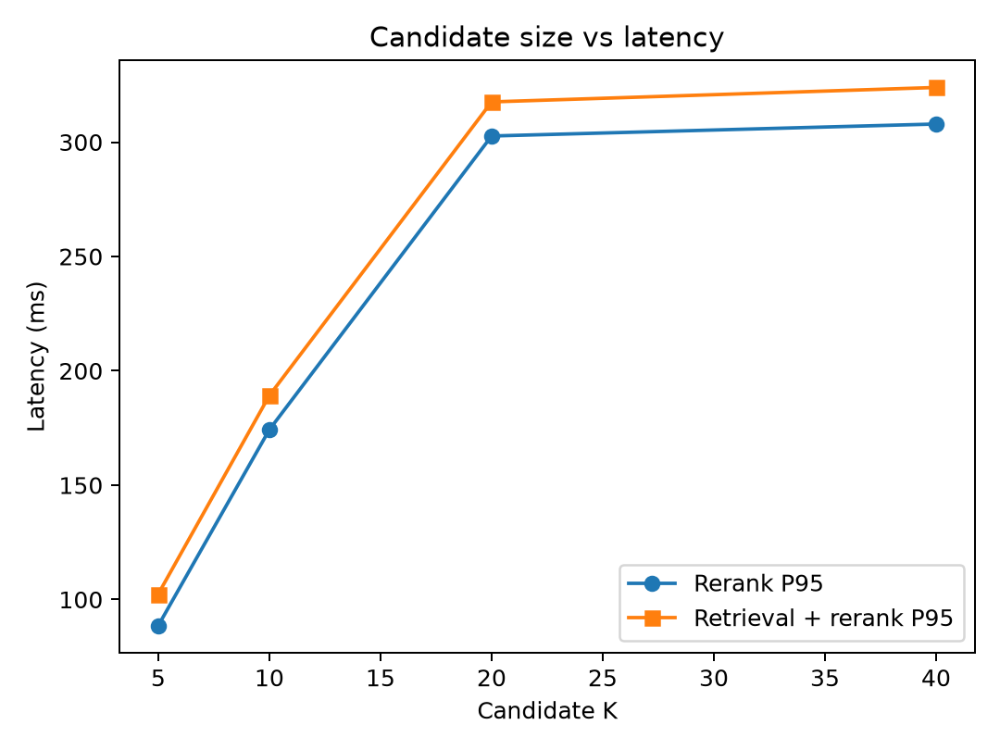
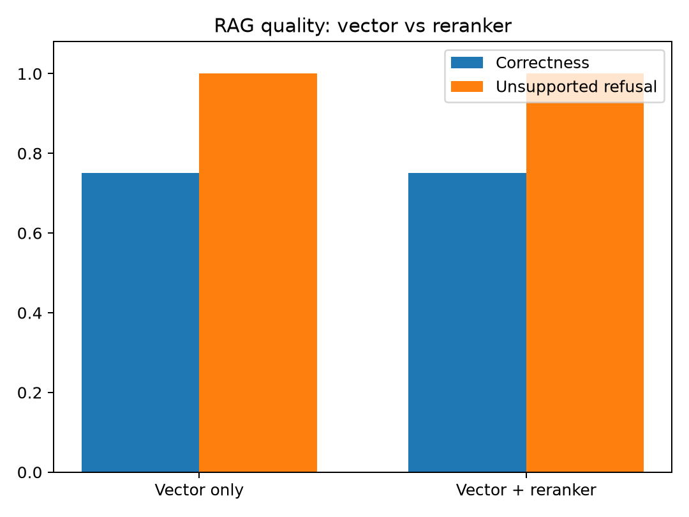

# Day 7 — Two-Stage Retrieval with Cross-Encoder Reranking

## Research Question

Does second-stage cross-encoder reranking improve retrieval ranking and downstream RAG quality enough to justify its additional latency?

## Hypothesis

A cross-encoder that jointly reads each query and passage was expected to improve Hit@1 and MRR while preserving candidate recall, at a measurable latency cost.

## Architecture

```text
Question → MiniLM query embedding → vector candidates
         → ms-marco-MiniLM-L6-v2 cross-encoder
         → best five chunks → Qwen → answer
```

The cross-encoder never replaces first-stage vector retrieval. It scores only a bounded candidate set. `RAGService` supports both architectures, exposes vector/rerank/generation latency separately, and keeps reranking disabled by default because of the experimental result.

## Controlled Variables

- Four-document technical corpus
- Sixteen answerable retrieval questions
- MiniLM embedding model selected in the preceding experiment
- 100-token chunks with 20-token overlap
- Normalized cosine first-stage retrieval
- Five final context chunks
- Qwen2.5-1.5B-Instruct, prompt, refusal threshold, and hardware

## Reranker

`cross-encoder/ms-marco-MiniLM-L6-v2` scores query/passage pairs jointly. A sigmoid maps its logits to inspectable 0–1 values without changing order. These values were not compared with cosine similarity and were not used as a confidence threshold.

## Candidate-K Experiment

| Candidate K | Candidate Hit | Reranked Hit@1 | Hit@3 | Hit@5 | MRR | Rerank P95 (ms) | Total retrieval P95 (ms) | Pairs/sec |
|---:|---:|---:|---:|---:|---:|---:|---:|---:|
| 5 | 1.000 | 1.000 | 1.000 | 1.000 | 1.000 | 88.59 | 102.41 | 60.16 |
| 10 | 1.000 | 1.000 | 1.000 | 1.000 | 1.000 | 174.27 | 189.21 | 63.81 |
| 20 | 1.000 | 1.000 | 1.000 | 1.000 | 1.000 | 302.68 | 317.60 | 61.04 |
| 40* | 1.000 | 1.000 | 1.000 | 1.000 | 1.000 | 307.92 | 323.91 | 60.32 |

`*` The corpus contains only 17 chunks, so requested K=20 and K=40 both reranked 17 pairs. This explains their similar cost.

Candidate recall was already perfect at K=5, and the vector retriever already put the relevant document first for every question. The reranker therefore had no document-level failure available to rescue.



## Ranking Movement

At K=20 the relevant document remained rank 1 for all sixteen questions. The winning chunk changed from vector rank 2 to rerank rank 1 for q002, q009, q016, and q017. The complete sixteen-question table is in `ranking-movement.md`.

Manual inspection also found a regression pattern: for the replication query, the correct chunk remained first, but unrelated MVCC and Kafka chunks were promoted into the final five. Generic MS MARCO relevance patterns do not always map cleanly to technical database context.

## Score Distribution

| Group | Pairs | Mean score | Minimum | Maximum |
|---|---:|---:|---:|---:|
| Chunks from relevant source | 68 | 0.6233 | 0.000011 | 0.9997 |
| Chunks from irrelevant source | 204 | 0.0206 | 0.000010 | 0.9899 |

The averages separate well, but the ranges overlap almost completely and one irrelevant chunk scored 0.9899. A hard threshold such as 0.5 is therefore not justified by this dataset.

## RAG Results

The vector-only arm reuses the exact MiniLM/100-20/Qwen baseline. The reranked arm changes only the ordering step.

| Architecture | Correctness | Groundedness | Citation support | Unsupported refusal | Retrieval P95 (s) | Generation P95 (s) | End-to-end P95 (s) |
|---|---:|---:|---:|---:|---:|---:|---:|
| Vector only | 0.75 | 0.75 | 0.00 | 1.00 | 0.0207 | 129.75 | 129.77 |
| Vector + reranker | 0.75 | 0.75 | 0.00 | 1.00 | 0.3290 | 91.19 | 91.50 |

Reranking did not change answer correctness, groundedness, citation support, or refusal accuracy. The lower generation time in the reranked arm is not treated as a reranker benefit: each architecture has a single sequential CPU run, and generation latency varies with answer length and machine state. Retrieval overhead, by contrast, is directly and repeatedly measured.



## Selected Configuration

```text
USE_RERANKER=false
RETRIEVAL_CANDIDATE_K=20
RERANK_TOP_K=5
```

Vector-only retrieval remains the production default. The two-stage path remains implemented and can be enabled with `RAGService(use_reranker=True)` for future experiments.

## Trade-offs

- Reranking costs roughly 0.30 seconds P95 at the effective 17-candidate maximum.
- No document-level ranking or end-to-end quality metric improved.
- Chunk ordering changed in several cases, but current labels cannot score whether those changes are better.
- The reranker can promote highly scored irrelevant technical passages into final context.

## Limitations

- Four clearly separated source documents make vector Hit@1 trivial to saturate.
- Relevance labels are document-level and binary; chunk-level graded labels are needed before NDCG is meaningful.
- There are no vector near-misses at ranks 6–20, so candidate rescue cannot be tested.
- The K=40 condition cannot be realized with only 17 chunks.
- PostgreSQL was unavailable because Docker Desktop 4.87 crashes on inaccessible Windows Unix-socket reparse points. The experiment used the equivalent in-memory normalized-cosine retriever; the production PostgreSQL pipeline remains supported.
- RAG latency has only one CPU sample per question and citations remain a separate prompt-compliance issue.

## Future Work

Scale the corpus, create chunk-level graded relevance labels, add deliberately difficult paraphrases and near-miss candidates, then repeat K=5/10/20/40. Evaluate NDCG only after graded labels exist, and consider domain-adapting the reranker to database and distributed-systems passages.
