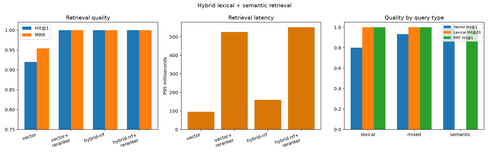
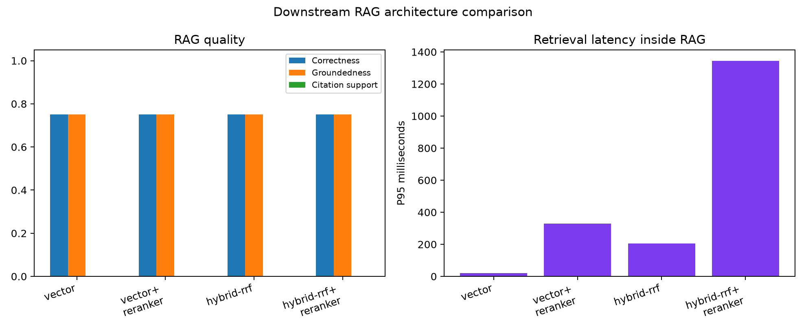

# Day 8 — Hybrid Lexical + Semantic Retrieval

## Outcome

PostgreSQL full-text search and Reciprocal Rank Fusion are now integrated with the existing pgvector and optional cross-encoder stages. On 50 answerable questions, hybrid RRF improved Hit@1 from 0.920 to 1.000 and MRR from 0.954 to 1.000. It matched the cross-encoder architectures at substantially lower latency.

## Frozen inputs

- Four source documents and 17 stored chunks
- 100-token chunks with 20-token overlap
- `sentence-transformers/all-MiniLM-L6-v2`
- Twenty vector candidates and twenty lexical candidates
- RRF constant 60 and five final chunks
- `cross-encoder/ms-marco-MiniLM-L6-v2` when enabled
- Qwen2.5-1.5B-Instruct for the controlled RAG subset

## Implementation

`chunks.search_vector` is a stored, generated `tsvector` using PostgreSQL's `simple` configuration, with a GIN index named `idx_chunks_search_vector`. `LexicalRetriever` ranks matching chunks with `ts_rank_cd`; `reciprocal_rank_fusion` combines ranking positions rather than incomparable raw scores. `HybridRetriever`, `RetrievalPipeline`, `RAGService`, and the CLI expose separate vector, lexical, fusion, reranking, and generation timings.

The production pipeline supports four measured architectures:

```text
Vector → Top 5
Vector Top 20 → cross-encoder → Top 5
Vector Top 20 + lexical Top 20 → RRF → Top 5
Vector Top 20 + lexical Top 20 → RRF Top 20 → cross-encoder → Top 5
```

## Retrieval results

| Architecture | Hit@1 | Hit@5 | MRR | Mean (ms) | P95 (ms) |
|---|---:|---:|---:|---:|---:|
| Vector | 0.920 | 1.000 | 0.954 | 79.15 | 95.43 |
| Vector + reranker | 1.000 | 1.000 | 1.000 | 439.16 | 526.58 |
| Hybrid RRF | 1.000 | 1.000 | 1.000 | 135.39 | 160.20 |
| Hybrid RRF + reranker | 1.000 | 1.000 | 1.000 | 486.18 | 551.42 |

RRF corrected four vector rank-one errors involving `WAL`, transaction-ID wraparound, and Kafka replication-factor terminology. At candidate depth 20, vector retrieval already covers all 17 chunks, so lexical candidate rescue is necessarily 0%. Dense retrieval rescues all 20 semantic paraphrases missed by strict lexical AND matching.



## Downstream RAG results

The six-question controlled subset contains four answerable and two unsupported questions. Earlier vector arms were reused unchanged; the two hybrid arms were newly generated with the same model and settings.

| Architecture | Correctness | Groundedness | Citation support | Unsupported refusal | Retrieval P95 (s) |
|---|---:|---:|---:|---:|---:|
| Vector | 0.75 | 0.75 | 0.00 | 1.00 | 0.0207 |
| Vector + reranker | 0.75 | 0.75 | 0.00 | 1.00 | 0.3290 |
| Hybrid RRF | 0.75 | 0.75 | 0.00 | 1.00 | 0.2058 |
| Hybrid RRF + reranker | 0.75 | 0.75 | 0.00 | 1.00 | 1.3453 |

All architectures preserved correct refusal behavior. None fixed Qwen's unsupported MVCC overclaim or its failure to emit citations. Generation P95 varied from 91 to 203 seconds across single sequential CPU/offload runs and is not attributed to retrieval architecture.



## Selected configuration

```text
RETRIEVAL_MODE=hybrid
LEXICAL_CANDIDATE_K=20
HYBRID_CANDIDATE_K=20
RRF_K=60
USE_RERANKER=false
```

Hybrid RRF is selected because it reaches perfect document-level Hit@1 and MRR without the cross-encoder's roughly 0.4-second benchmark overhead. The full hybrid-plus-reranker path remains implemented for a future larger, harder corpus.

## Limitations

- Document-level binary labels cannot measure within-document chunk quality; graded chunk labels are needed for NDCG.
- Candidate depth 20 exceeds the 17-chunk corpus, making vector candidate recall trivial and lexical candidate rescue impossible.
- PostgreSQL `simple` plus `websearch_to_tsquery` is deliberately literal and misses natural-language paraphrases.
- The RAG subset is small, manual, and generation runs are CPU/disk offloaded.
- RRF constants are indistinguishable on this corpus.
- The generator's citation compliance and grounding remain separate failures for the next experiment.

## Reproduction

```powershell
python -m src.ingest datasets/raw
python -m evaluation.inspect_hybrid
python -m evaluation.evaluate_hybrid --label hybrid
python -m evaluation.evaluate_rrf_sensitivity
python -m evaluation.evaluate_hybrid_rag
python -m evaluation.score_hybrid_rag
```
