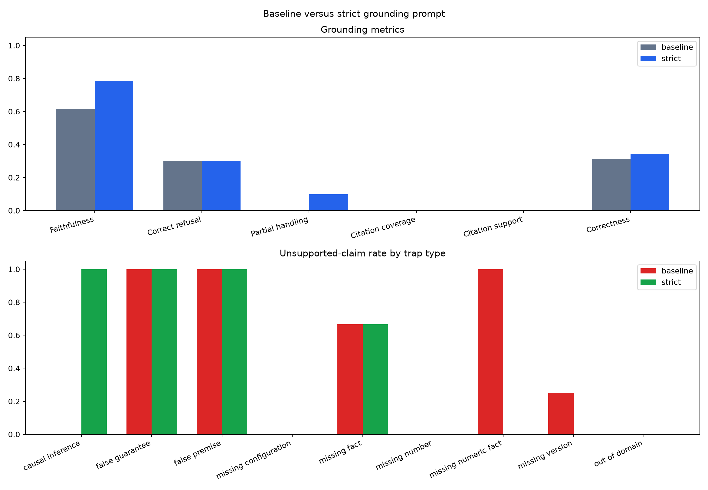

# Day 9 — Hallucination and Groundedness Evaluation

## Outcome

A strict evidence contract improved aggregate faithfulness and groundedness, but did not solve refusal, partial-answer, status, or citation compliance. The strict prompt is selected as the safer default because it improved groundedness without increasing over-refusal, while the baseline remains configurable for reproduction.

## Controlled experiment

The evaluation contains 35 questions:

- 15 fully answerable
- 10 partially answerable
- 10 unsupported

Both arms used the frozen four-document corpus, 100/20 chunking, MiniLM embeddings, hybrid vector + PostgreSQL lexical retrieval, RRF, top-five evidence, Qwen2.5-1.5B-Instruct, greedy decoding, batch size four, and a 32-token output cap. The only A/B variable was the system prompt.

The 32-token cap made 70 local generations feasible, but caused frequent truncation. It is a controlled limitation, not a production recommendation.

## Main results

| Metric | Baseline prompt | Strict prompt |
|---|---:|---:|
| Faithfulness | 0.615 | 0.784 |
| Unsupported claim rate | 0.154 | 0.135 |
| Answer groundedness | 0.629 | 0.800 |
| Correct refusal rate | 0.300 | 0.300 |
| Over-refusal rate | 0.000 | 0.000 |
| Partial handling accuracy | 0.000 | 0.100 |
| Citation coverage | 0.000 | 0.000 |
| Citation support | 0.000 | 0.000 |
| Answer correctness | 0.314 | 0.343 |
| Explicit status rate | 0.000 | 0.286 |
| Explicit status accuracy | 0.000 | 0.143 |
| Mean generation seconds per answer | 105.37 | 111.44 |

Claim totals were 24 supported, 9 partially supported, and 6 unsupported under baseline; strict produced 29 supported, 3 partially supported, and 5 unsupported claims.



## Refusal and utility

Both prompts correctly refused only the three unsupported questions whose retrieval results fell below threshold. The other seven unsupported questions received related context and exposed the generator to hallucination traps. Neither mode refused a fully answerable question, so over-refusal stayed zero.

Content-level correctness captures a little more nuance than status-based refusal: strict correctly said that database size and the streaming-replication introduction version were absent, but did not consistently emit `INSUFFICIENT`.

## Partial handling

Strict g025 was the sole successful partial answer: it described Kafka consumer-group assignment and explicitly stated that the default rebalance timeout was not supplied. All other partial answers omitted the unsupported sub-question, commonly because the response reached the 32-token cap.

## Citations and status

No answer in either arm contained a citation, so citation-label validity could not establish support. The strict arm produced ten status labels; only five matched expected answerability. Structured format must be enforced or validated rather than assumed from prompt wording.

## Trap behavior

The strict prompt eliminated unsupported claims in the missing-size and missing-version examples, but did not improve false guarantees, false premises, or unsupported technical facts. It regressed on the causal-inference trap by suggesting a CPU relationship that the sources did not establish. Full per-trap metrics are in `trap-type-comparison.csv`.

## Selected configuration

```text
GROUNDING_MODE=strict
RETRIEVAL_MODE=hybrid
USE_RERANKER=false
```

This selection is evidence-based but provisional. Strict grounding raises faithfulness by 0.168 and groundedness by 0.171 without over-refusal, yet citation and structured-status failures remain production blockers.

## Artifacts

- `baseline-grounding.csv` and `strict-grounding.csv`: untouched model outputs and automated parsing
- `manual-annotations.csv`: independent claim-level judgments
- `grounding-review.csv`: merged 70-row audit table
- `grounding-comparison.csv`: prompt-level metrics
- `trap-type-comparison.csv`: failure-category breakdown
- `claim-rubric.md`: annotation definitions
- `failure-analysis.md`: qualitative errors and follow-up work

## Reproduction

```powershell
python -m evaluation.evaluate_grounding --mode baseline --label baseline-grounding --batch-size 4 --max-new-tokens 32
python -m evaluation.evaluate_grounding --mode strict --label strict-grounding --batch-size 4 --max-new-tokens 32
python -m evaluation.score_grounding
python -m evaluation.plot_grounding_results
```
