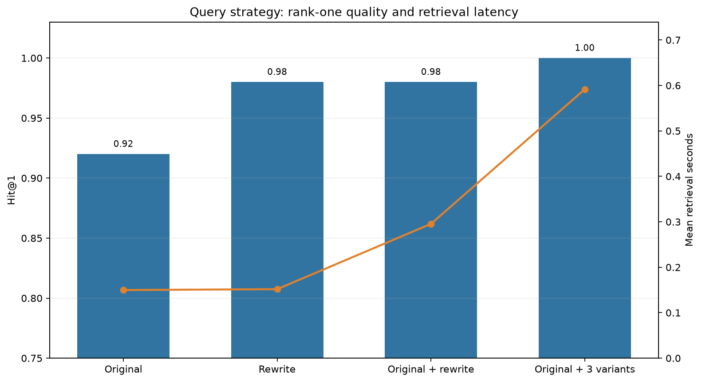

# Query transformation and multi-query retrieval

## Outcome

Multi-query retrieval ranked the labeled source first for all 50 questions, improving Hit@1 from 0.92 to 1.00 and rescuing all four original-query rank-one misses without a regression. It remains opt-in because retrieval alone became 3.95 times slower and local query generation adds a much larger cost. The original query is always retained by the two ensemble strategies.

## Design

This experiment freezes the four-document, 17-chunk corpus; 100/20 chunking; MiniLM embeddings; PostgreSQL lexical retrieval; first-level vector/lexical RRF; no reranker; strict grounding; layered security handling; and local hardware. The independent variable is original-only, rewrite-only, original plus rewrite, or original plus three diverse variants.

The benchmark has 50 answerable questions, evenly split among direct, paraphrased, vague, exact-identifier, and multi-part categories. Frozen reviewed variants make retrieval comparisons reproducible. A separate 20-query local-Qwen inspection tests whether the configured transformer preserves meaning and identifiers without inventing terminology.

## Results

| Strategy | Queries | Hit@1 | Hit@5 | MRR | Rescue@1 | Regression@1 | Mean retrieval |
|---|---:|---:|---:|---:|---:|---:|---:|
| Original | 1 | 0.92 | 1.00 | 0.941 | 0.00 | 0.00 | 0.150 s |
| Rewrite only | 1 | 0.98 | 1.00 | 0.990 | 0.75 | 0.00 | 0.152 s |
| Original + rewrite | 2 | 0.98 | 1.00 | 0.990 | 0.75 | 0.00 | 0.295 s |
| Original + 3 variants | 4 | 1.00 | 1.00 | 1.000 | 1.00 | 0.00 | 0.592 s |

Candidate Hit@20 and Hit@5 were 1.00 for every arm. Consequently, Rescue@5 is undefined: there were no original misses at five to rescue. The meaningful change is rank-one placement.

The four rank-one misses under original-only retrieval were two paraphrases and two vague questions. Multi-query rescued all four. Paraphrase Hit@1 rose from 0.80 to 1.00, and vague-query Hit@1 rose from 0.80 to 1.00. Direct, exact-identifier, and multi-part questions remained at 1.00. Exact-identifier retrieval therefore showed no regression.



## Transformation inspection

The separate 20-query real-model inspection produced the following manually reviewed results:

| Metric | Result |
|---|---:|
| Meaning preservation | 0.775 |
| Identifier preservation | 0.900 |
| Hallucinated terminology rate | 0.150 |
| Safe fallback rate | 0.200 |
| Mean transformation time | 67.893 s/query |

All four direct queries preserved meaning. Vague queries were weakest at 0.500 meaning preservation and a 0.500 hallucinated-terminology rate: one ambiguous “messages” query was incorrectly rewritten as email. Multi-part questions scored 0.625 for meaning and 0.500 for identifier preservation; one rewrite dropped both `MVCC` and `VACUUM` and drifted into deadlock claims. Four malformed generations safely fell back to the original. These results do not alter the frozen retrieval comparison, which uses reviewed variants for reproducibility, but they strongly argue against enabling local rewriting by default.

## Decision

Original plus three variants is the retrieval-quality winner and is available through `--query-strategy multi_query`. It retains the original, measurably improves difficult categories, and has no exact-identifier retrieval regression. The production-style default remains `original`: the 0.08 Hit@1 gain does not justify a fourfold retrieval cost plus 67.9 seconds of local transformation time on this already saturated corpus, especially when real rewrites preserved meaning only 77.5% by the stated rubric. Rewrite-only is not selected even though its retrieval is fast, because discarding the user's original wording creates avoidable identifier and intent risk.

## Limitations

The corpus has only four documents and 17 chunks, so Candidate Hit@20 can saturate and query variants can look stronger than they would in a large, confusable corpus. The 50 frozen variants are manually authored and are therefore evaluated separately from the 20 real model transformations. Rewrites cannot create evidence missing from the corpus. Vague queries may admit multiple reasonable domains, while this dataset assigns one known source. Local CPU generation makes transformation latency much larger than retrieval latency.

## Reproduction

```powershell
python -m evaluation.evaluate_multi_query
python -m evaluation.inspect_query_transform --limit 20 --batch-size 4 --max-new-tokens 64
python -m evaluation.plot_multi_query_results
python -m src.rag "Why is the log filling the disk?" --query-strategy multi_query
```
