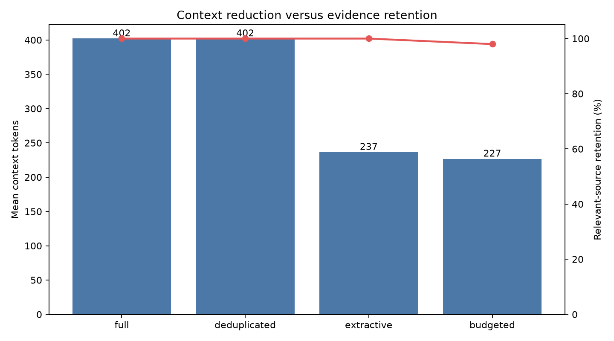

# Context selection, de-duplication, and compression

## Outcome

Sentence extraction cut mean Top-5 context from 402.1 to 236.5 Qwen tokens (41.2%) while retaining a labeled relevant source for all 50 frozen questions. However, the balanced five-question generation sample fell from 0.80 to 0.60 manual correctness. The experiment therefore does **not** establish quality-preserving compression, and `full` remains the production-style default.

## Frozen system

The experiment keeps the four-document, 17-chunk corpus; 100/20 chunking; MiniLM embeddings; hybrid vector plus PostgreSQL lexical retrieval with RRF; no cross-encoder; original-query retrieval; strict grounding; layered security; Qwen2.5-1.5B-Instruct; and local hardware fixed. Only post-retrieval context handling changes.

## Retrieval-side results

| Strategy | Questions | Mean context tokens | Compression | Relevant source retained | Mean unique sources | Evidence-density proxy |
|---|---:|---:|---:|---:|---:|---:|
| Full | 50 | 402.1 | 0.0% | 100% | 2.16 | 0.856 |
| De-duplicated, 0.92 | 50 | 402.1 | 0.0% | 100% | 2.16 | 0.856 |
| Extractive, 50% | 50 | 236.5 | 41.2% | 100% | 2.16 | 1.478 |
| Extractive + 250-token budget | 50 | 226.7 | 43.5% | 98% | 2.10 | 1.511 |

The evidence-density value is a project-specific proxy: labeled relevant chunks per 100 context tokens. It is not a claim-level factual-density standard.



## Sensitivity findings

- A 0.85 near-duplicate threshold removed 5.8% of context with 100% relevant-source retention. Thresholds 0.90, 0.92, and 0.95 removed nothing, showing that overlap in these stored chunks is not semantically identical enough for the selected 0.92 rule.
- Keeping 75%, 50%, and 25% of sentences removed 14.2%, 41.2%, and 60.8% respectively. All retained a labeled source, but source retention alone cannot prove that every necessary sentence survived.
- The requested 500–2000 token budgets did not bind after 50% extraction; mean context stayed at 236.5 tokens. The added 250-token diagnostic reduced context to 226.7 tokens but lost the labeled source on one of 50 questions.
- A one-sentence neighbor window preserved labeled sources but reduced compression from 41.2% to 5.9%, nearly cancelling the benefit on this short corpus.
- For the ten `MULTI_PART` questions, 50% extraction retained the labeled source in every case and reduced mean context from 398.4 to 242.7 tokens. The 250-token budget reduced mean unique sources from 2.1 to 2.0.

## Generation sample

One question from each query type was run through all four strategies. Prompt and output counts use the actual Qwen tokenizer. Identical full/de-duplicated outputs were reused because their contexts were byte-for-byte identical.

| Strategy | Questions | Mean context | Mean prompt | Correctness | Faithfulness | Citation presence | Mean generation |
|---|---:|---:|---:|---:|---:|---:|---:|
| Full | 5 | 400 | 1101.6 | 0.80 | 1.00 | 0.00 | 109.8 s |
| De-duplicated | 5 | 400 | 1101.6 | 0.80 | 1.00 | 0.00 | reused |
| Extractive | 5 | 252 | 952.0 | 0.60 | 1.00 | 0.00 | 95.9 s |
| Budgeted | 5 | 230 | 929.4 | 0.60 | 1.00 | 0.00 | 96.4 s |

Compression reduced prompt tokens by 13.6–15.6% and measured generation time by roughly 12–13 seconds in this sample. These latency comparisons are descriptive only: five questions are insufficient for stable performance claims, and disk/CPU offload adds substantial variance.

All generated claims were supported by retained fragments, but Qwen did not emit citations or the requested evidence-status prefix in this short run. The 20-token cap also truncated answers. The exact-identifier compressed answer regressed because it began a numbered list but ended before stating a role; the multi-part question was incomplete under every strategy. See `compression-regressions.md`.

## Decision

Keep `CONTEXT_STRATEGY=full` as the default. The 50% extractive strategy is a useful opt-in experiment and materially improves evidence density, but the current answer sample does not meet the quality-preserving criterion. Reject the 250-token budget as a default because it reduced labeled-source retention to 98%. Keep 0.92 as the conservative near-duplicate threshold even though it is a no-op on the current corpus.

The next validation should increase the generation cap, use a larger manually reviewed sample, and measure claim-level citation support before enabling extraction by default. Abstractive compression is deferred because it adds another hallucination and latency stage before extractive safety is established.

## Reproduction

```powershell
python -m evaluation.evaluate_context
python -m evaluation.evaluate_context_rag --max-new-tokens 20
python -m evaluation.recount_context_tokens
python -m evaluation.score_context_rag
python -m evaluation.plot_context_results
python -m src.rag "How does PostgreSQL streaming replication work?" --context-strategy extractive
```
