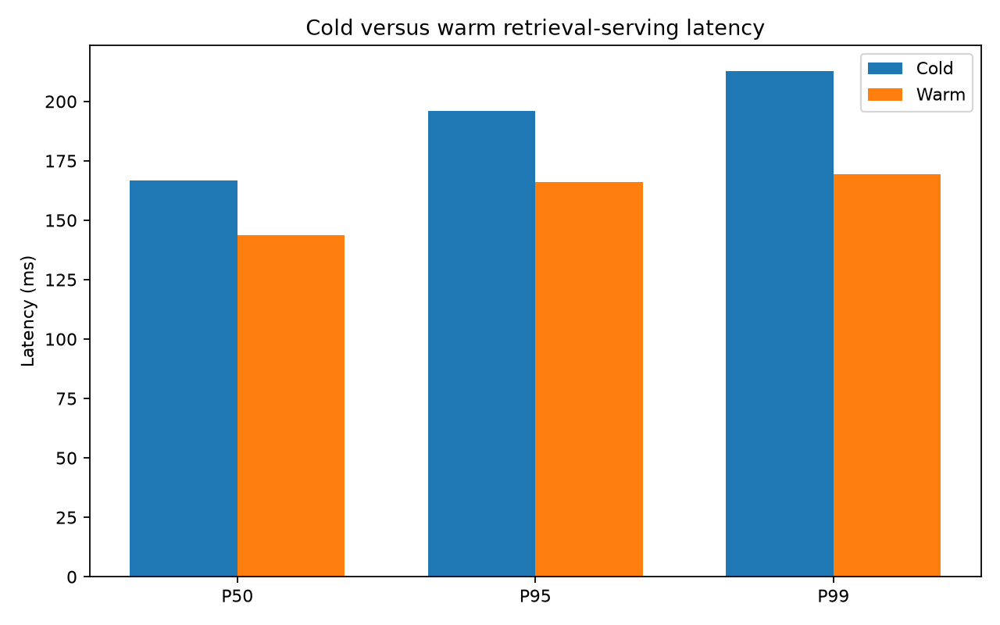

# Caching, repeated-work elimination, and invalidation

## Outcome

The versioned Redis design safely removed repeated embedding, transformation, and retrieval work. On the frozen 100-request workload, the cold pass achieved the expected 30% exact-repeat hit rate; near-repeats did not collide. The identical warm pass reached 100% embedding and retrieval hits with no ranking mismatches. Warm retrieval-serving P50/P95/P99 improved by 13.7%/15.3%/20.4%.

## Architecture and safety

Keys combine a hashed normalized query with the configuration that controls the cached output. Retrieval and response keys additionally include `corpus_version`. Ingestion stores SHA-256 document hashes, skips unchanged files, and increments the corpus namespace only when indexed content or corpus configuration changes.

Retrieval values contain chunk identifiers and scores—not duplicated text. A hit rehydrates current chunk text from PostgreSQL. The response cache is opt-in, exact-query only, preserves chunk/citation provenance, requires a grounded status and valid citations, and uses a `SET NX` creation lock. Redis is an optimization: every operation fails open.

## Workload

The deterministic workload contains 100 requests:

| Kind | Requests | Cold retrieval hit rate |
|---|---:|---:|
| Unique | 40 | 0% |
| Exact repeat | 30 | 100% |
| Semantic near-repeat | 20 | 0% |
| New query | 10 | 0% |

This proves that only exact normalized queries are reused; semantic response caching is deliberately absent.

## Cold versus warm results

| Metric | Cold | Warm | Reduction |
|---|---:|---:|---:|
| Embedding hit rate | 30% | 100% | — |
| Retrieval hit rate | 30% | 100% | — |
| Serving P50 | 166.6 ms | 143.7 ms | 13.7% |
| Serving P95 | 196.1 ms | 166.1 ms | 15.3% |
| Serving P99 | 212.9 ms | 169.5 ms | 20.4% |
| Mean embedding call | 41.9 ms | 1.0 ms | 97.5% |
| Mean retrieval compute | 97.6 ms | 0.0 ms | 100% |

Cold retrieval misses averaged 176.6 ms, while intra-run exact-repeat hits averaged 141.7 ms—a 19.8% reduction. Warm results returned the same ordered chunk identifiers as cold results for all 100 requests.



The warm retrieval path still checks the corpus version and hydrates identifiers from PostgreSQL. Those correctness-preserving database round trips dominate the remaining ~144 ms median, explaining why eliminated retrieval compute does not translate into an equally large end-to-end percentage.

## Query transformation

A real Qwen transformation took 23.734 seconds on a miss and 0.0009 seconds on the exact repeat. The capped generation produced the transformer's safe original-query fallback, which was cached under the model and prompt fingerprint. This validates the latency opportunity but does not change the previous decision to keep transformation disabled by default.

## Response-cache experiment

The integration fixture produced a 254.4 ms miss followed by a 112.8 ms hit with identical grounded answer, citation, and chunk identifiers. These are structural integration measurements using a deterministic fixture, not Qwen performance numbers. Response caching remains disabled by default because serving an outdated answer is a larger risk than recomputing it.

## Freshness and resilience

- Initial hash population advanced corpus version 1 → 2; identical re-ingestion kept version 2.
- A controlled version bump 2 → 3 forced a MISS for the same query while leaving the old entry to expire naturally.
- Live retrieval keys carried the configured one-hour TTL.
- With Redis stopped, real hybrid retrieval returned five chunks and reported the cache unavailable; Redis was restarted and returned `PONG`.

## Decision

Enable embedding, transformation (when that stage is enabled), and retrieval caches. Keep response caching opt-in. Preserve exact-query semantics, corpus/config fingerprints, identifier-only retrieval entries, and fail-open behavior. Do not add semantic answer caching until intent-equivalence and citation-freshness evaluation exist.

## Limitations

The corpus contains only 17 chunks, and PostgreSQL connection setup dominates warm latency. The workload models a single process and does not load-test concurrent stampedes. TTL values are starting experimental settings, not optimized recommendations. The query-transform benchmark contains one real query, and the response-cache experiment uses a deterministic fixture because repeated local Qwen generation is prohibitively slow on this hardware.

## Reproduction

```powershell
docker compose up -d redis postgres
python -m src.ingest datasets/raw
python -m evaluation.build_cache_workload
python -m evaluation.evaluate_cache --label cold --flush
python -m evaluation.evaluate_cache --label warm
python -m evaluation.evaluate_embedding_cache
python -m evaluation.evaluate_transform_cache
python -m evaluation.evaluate_response_cache
python -m evaluation.evaluate_cache_invalidation
python -m evaluation.summarize_cache
python -m evaluation.plot_cache_results
```
