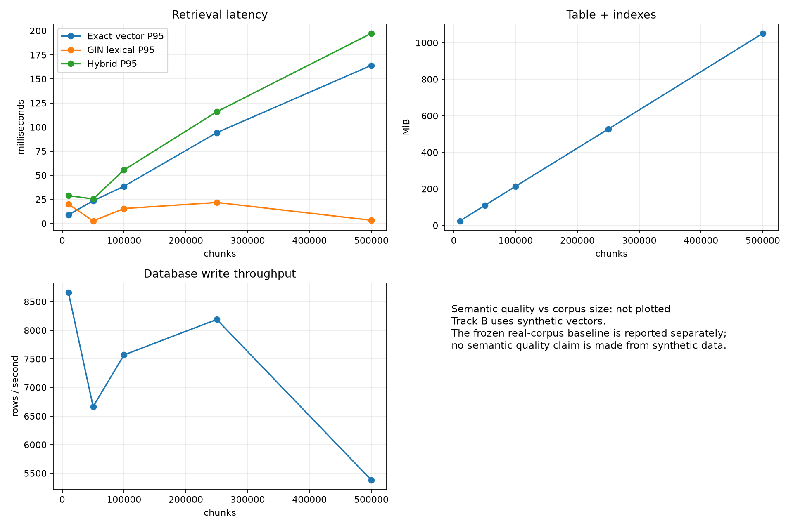

# Corpus-volume scalability report

## Outcome

The exact-vector baseline remained operational through 500K chunks, the largest tier allowed by the preset host-safety policy. Exact-vector warm P95 rose from 8.9 ms at 10K to 164.1 ms at 500K. The table and indexes grew from 24.0 MiB to 1,051.4 MiB. A 1M run was stopped before ingestion because its projected memory demand would likely cross the fixed 90% host-memory limit.

This is a database-mechanics conclusion, not a semantic-quality conclusion. Synthetic vectors were never used to compute Hit@K, Recall, or MRR.

## Method

- Isolated database: `ragdb_scale`; code rejects `ragdb` and every other database name.
- Scale tiers: 10K, 50K, 100K, 250K, 500K; 1M planned but safely stopped.
- Data: deterministic seeded unit vectors, 384 dimensions, templated searchable text.
- Loader: streaming batches of 500 with database checkpoints and bounded process memory.
- Workload: 50 fixed queries, Top-20, concurrency 1.
- Retrieval: exact cosine vector scan, GIN lexical retrieval, and reciprocal-rank hybrid fusion.
- Passes: first-pass and immediate warm-repeat. No false cold-cache claim is made.
- Generation: excluded so retrieval scaling is measured independently.

## Central results

| Chunks | Increment ingested | Ingestion chunks/s | Relation MiB | Vector P50/P95/P99 ms | Lexical P50/P95/P99 ms | Hybrid P50/P95/P99 ms |
|---:|---:|---:|---:|---:|---:|---:|
| 10K | 10K | 3,270 | 24.0 | 7.9 / 8.9 / 10.2 | 19.0 / 20.0 / 21.6 | 27.2 / 28.9 / 29.0 |
| 50K | 40K | 3,035 | 108.8 | 22.3 / 23.5 / 24.1 | 1.9 / 2.6 / 2.7 | 24.4 / 25.4 / 29.2 |
| 100K | 50K | 3,153 | 213.8 | 35.4 / 38.6 / 44.4 | 14.5 / 15.5 / 16.1 | 50.0 / 55.6 / 59.6 |
| 250K | 150K | 3,304 | 527.3 | 78.9 / 94.2 / 103.3 | 17.3 / 21.8 / 24.4 | 95.1 / 115.9 / 142.9 |
| 500K | 250K | 2,595 | 1,051.4 | 142.0 / 164.1 / 1,481.8 | 2.4 / 3.3 / 15.4 | 142.9 / 197.3 / 1,508.0 |

Machine-readable results are in `scale-comparison.csv`; query-level timings are under `raw/`.

## Interpretation

### Exact vector search

The corpus grew 50× from 10K to 500K while vector P95 grew about 18.5×. It did not grow perfectly linearly because cache state, fixed query overhead, PostgreSQL execution, and host I/O also changed, but the direction is unambiguous. The representative 500K plan is still a sequential exact scan. P95 crosses 100 ms somewhere above 250K on this machine, and 500K develops a severe P99 outlier. This is the practical point at which the next experiment should evaluate HNSW/IVFFlat and recall-versus-latency trade-offs.

### Lexical and hybrid retrieval

GIN lexical latency was non-monotonic. It was highly sensitive to first-pass versus warm-repeat state and term selectivity, so it does not support a simple growth-rate claim from five points. Hybrid latency closely followed the exact-vector component; rank fusion remained around 0.03 ms and was not the bottleneck. No reranker was enabled, so its measured contribution is zero by design.

### Ingestion and storage

Incremental ingestion stayed between roughly 2.6K and 3.3K chunks/s. Loader peak RSS stayed near 51 MiB, confirming that batch streaming bounded client memory. Relation size was nearly linear and stabilized near 2.2 KB per chunk by 500K. Database write throughput declined at the largest increment, from 8.7K rows/s at 10K to 5.4K rows/s at 500K.

### Semantic quality

Track A's frozen real corpus has 4 documents, 17 chunks, 1,457 recorded tokens, and 50 fixed labelled questions. It scored 1.0 for Hit@1, Hit@3, Hit@5, Recall@5, and MRR. That is a baseline only. Because no large, diverse, labelled real-text corpus was available, quality-versus-volume is not claimed. The explicit N/A fields and `rank-degradation.csv` prevent synthetic mechanics data from being misread as semantic evidence.

## Decision

Use the exact scan for small corpora and as a correctness reference. On this host, treat 250K–500K chunks as the transition region where exact-vector tail latency and memory pressure justify ANN evaluation. Keep GIN lexical retrieval and measure ANN recall separately; do not replace the exact baseline until the next experiment quantifies the quality loss.

## Reproduction and artifacts

See `runbook.md` for commands and safety rules, `buffer-analysis.md` for plan evidence, `failure-analysis.md` for limitations, `storage.csv` for relation/index sizes, `resources.csv` for host samples, and `datasets/scaling/manifest.json` for reproducibility metadata.
